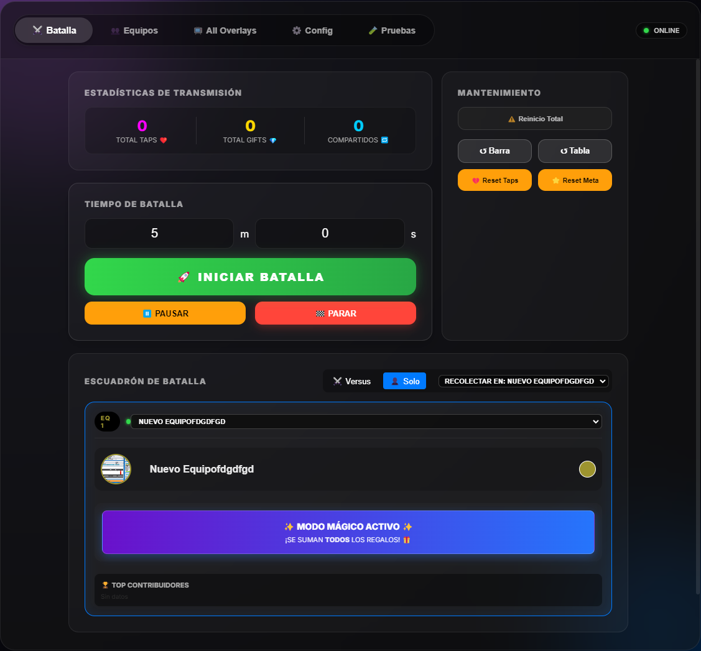
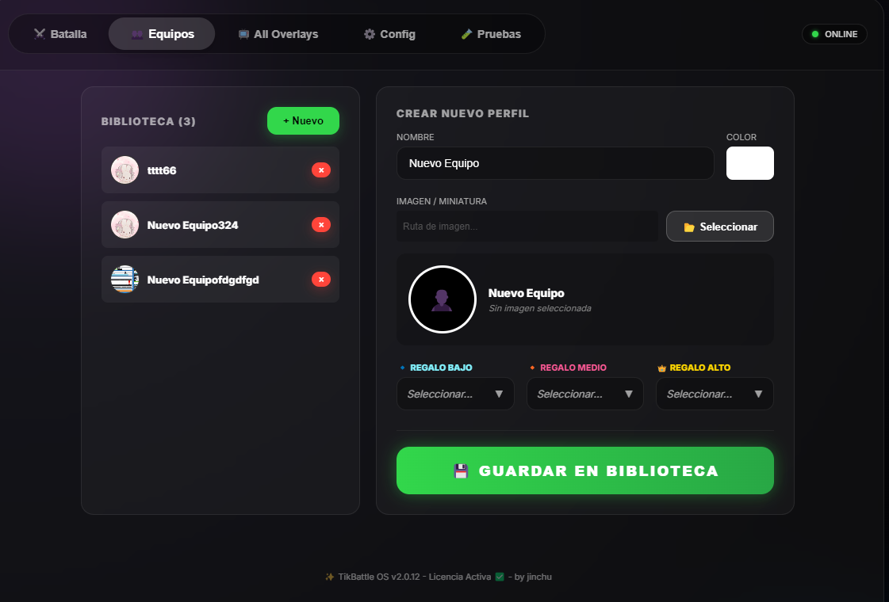
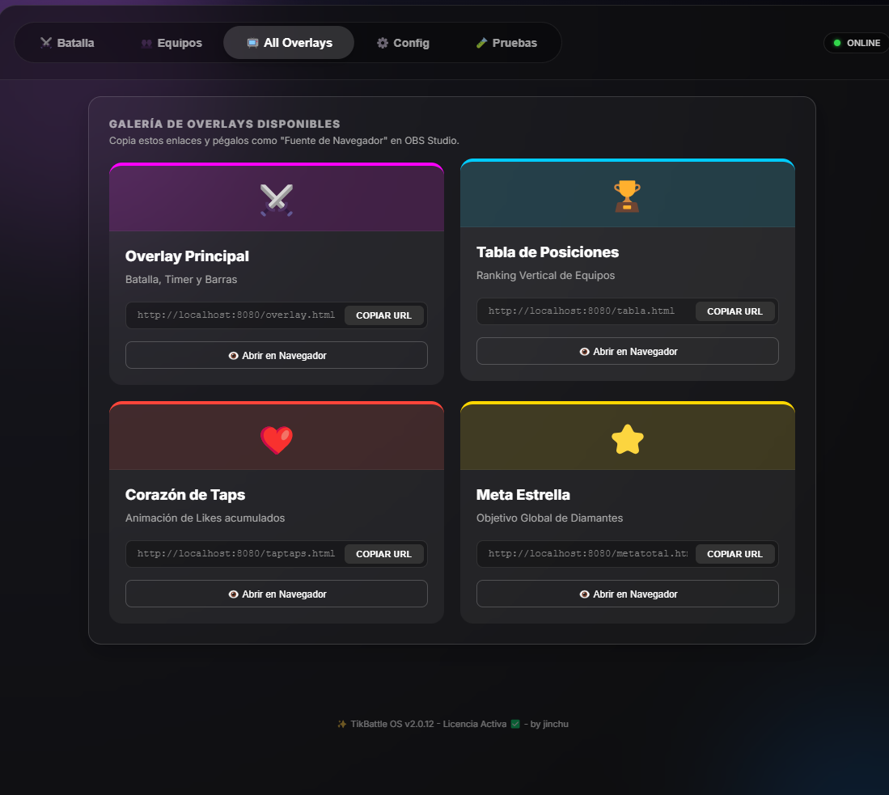

# ⚔️ Battle Interactive V2 | Motor de Gamificación para TikTok Live


> **Battle Interactive** es una suite de escritorio de alto rendimiento diseñada para transformar transmisiones de TikTok Live en experiencias interactivas y monetizables. Orquestada con Electron y React, actúa como un puente en tiempo real entre los eventos del chat y superposiciones visuales (Overlays) dinámicas para OBS.

---

## 🚀 Arquitectura y Características Técnicas

Esta aplicación no es solo un panel de control; es un sistema complejo de gestión de eventos en tiempo real.

### 🧠 1. Núcleo Lógico Inteligente (`GameLogic.js`)
El "cerebro" de la aplicación desacopla la lógica de negocio de la interfaz de usuario.
* **Procesamiento de Eventos:** Ingesta masiva de eventos (Gifts, Likes, Shares) con **Debouncing** para evitar saturación de CPU y re-renderizados innecesarios en React.
* **Modo "Mágico" (Solo Mode):** Algoritmo dinámico que detecta automáticamente cuando el streamer juega en solitario, ignorando los filtros estrictos de ID de regalos y permitiendo que **cualquier donación** (desde una Rosa hasta un Universo) sume puntos a la barra de progreso.
* **Persistencia de Sesión:** Sistema robusto de guardado en disco (`JSON`) para recuperar el estado de la batalla ante cierres inesperados.

### 🛡️ 2. Gestión Avanzada de Assets (`media://` Protocol)
Para superar las restricciones de seguridad de los navegadores modernos (Chromium) en Electron, hemos implementado una solución de ingeniería personalizada:
* **Protocolo Personalizado:** Registro del esquema `media://` en el *Main Process* para servir archivos locales de forma segura y performante.
* **Motor de Miniaturas:** Al cargar una imagen de alta resolución (4K/8K), el sistema genera automáticamente una versión optimizada (512px PNG) en segundo plano, garantizando que la UI y los Overlays carguen instantáneamente sin lag.
* **Sanitización de Rutas:** Algoritmos de corrección automática para rutas de Windows (`getImgSrc`) que manejan espacios, caracteres especiales y errores de formato.

### 📺 3. Sistema de Overlays para OBS
* **Servidor Local Integrado:** La aplicación levanta un servidor HTTP local que expone vistas transparentes (`/overlay/battle`, `/overlay/alerts`).
* **Reactividad en Tiempo Real:** Los Overlays se actualizan milisegundos después de recibir un regalo, gracias a una arquitectura basada en WebSockets/IPC optimizada.

### 🔐 4. Seguridad y Actualizaciones
* **Validación HWID:** Sistema de licencias vinculado al ID de hardware del dispositivo para prevenir uso no autorizado.
* **Auto-Update:** Integración con `electron-updater` para descargar e instalar parches automáticamente sin interrumpir el flujo del usuario.

---

## 🎮 Modos de Juego

| Modo | Descripción Técnica |
| :--- | :--- |
| **⚔️ VERSUS** | Lógica competitiva estricta. Permite configurar hasta 10 equipos. Cada equipo tiene "triggers" específicos (Regalo Bajo, Medio, Alto). El sistema filtra los regalos entrantes y solo asigna puntos si coinciden con la configuración estratégica. |
| **👤 SOLO (Magic)** | Lógica inclusiva. El sistema desactiva los filtros de ID. Cualquier evento de tipo `gift` con valor de diamantes > 0 se asigna automáticamente al equipo activo. Ideal para sesiones de "Just Chatting" o ASMR. |

---

## 📸 Capturas de Pantalla

*(Espacio reservado para tus capturas)*

| Dashboard de Control | Configuración de Equipos | Overlay  |
|:---:|:---:|:---:|
|  |  |  |

---

## 🛠️ Estructura del Proyecto

```text
src/
├── main/
│   ├── main.js             # Entry Point & Protocolo media://
│   ├── ipcManager.js       # Gestión de comunicación y Optimización de Imágenes
│   └── services/
│       ├── GameLogic.js    # Lógica de negocio, reglas de juego y cálculo de puntos
│       └── BattleService.js # Control de tiempos y estados de batalla
├── renderer/
│   ├── src/
│   │   ├── components/
│   │   │   ├── BattleTab.jsx # UI Principal (React)
│   │   │   └── TeamsTab.js   # Gestión de Biblioteca de Equipos
│   │   └── context/          # Estado Global (ConfigContext)
└── shared/
    └── channels.js         # Definición de canales IPC

```


## 💻 Instalación y Desarrollo
Requisitos: Node.js 16+, NPM.

* Clonar repositorio:

```bash

git clone [https://github.com/tu-usuario/battle-interactive.git](https://github.com/tu-usuario/battle-interactive.git)
```
* Instalar dependencias:

```bash

npm install
```
* Modo Desarrollo (Hot Reload):

```bash

npm run electron:dev
```
Compilar para Producción (Windows .exe):

```bash

npm run electron:build
```


## 🐛 Solución de Problemas Comunes

* Imágenes no cargan: El sistema usa encodeURI automáticamente. Asegúrate de no mover las imágenes de origen mientras la app corre.

* Error de Socket: Verifica que el puerto del servidor local (default: 8080) no esté ocupado por otra aplicación.

* Los puntos no suman en Versus: Revisa que hayas configurado el regalo exacto (ID) en la pestaña de Equipos. Si quieres que sume todo, cambia a Modo Solo.

## 📄 Licencia y Créditos

Desarrollado por Jinchu. Todos los derechos reservados. Prohibida su distribución sin autorización.
